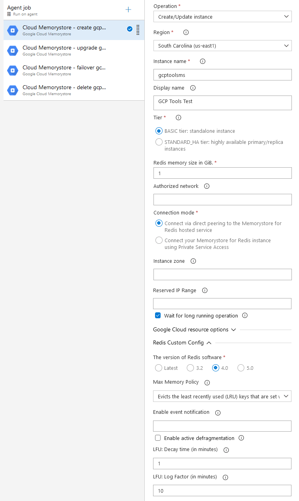
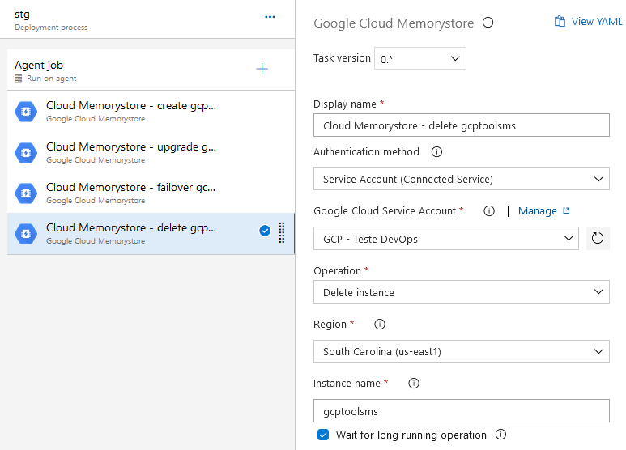
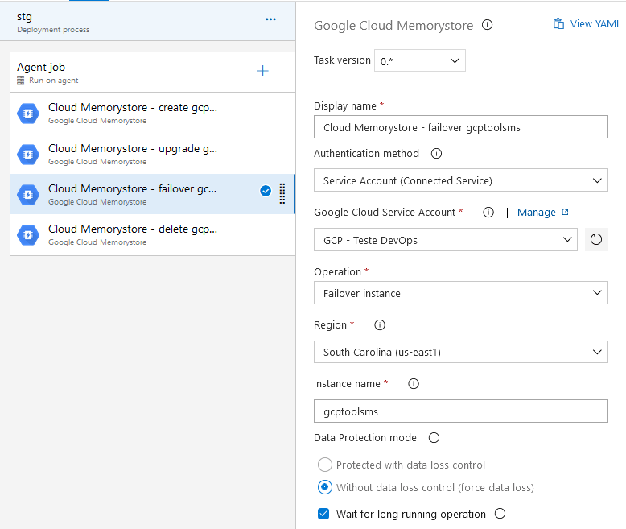
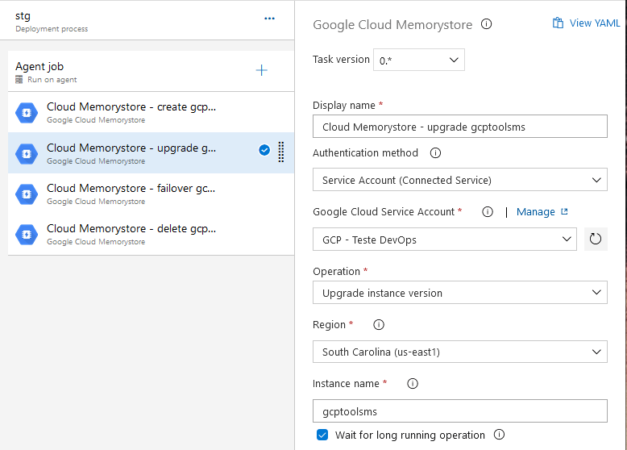

#  Google Cloud Memorystore

Manage Redis instances in Google Cloud Memorystore.

## Extension

Make sure you have the extension installed for your organization.  
See [How to install](/#how-to-install-extension) for more instructions.

## How to use

1. On your Release Pipeline add a new task and search for "Google Cloud Memorystore".  
2. Choose the operation and fill the required fields.

## Operations

- **Create/Update instance**  
  Create a new Redis instance.
- **Delete instance**  
  Delete the resource for your project.
- **Failover**  
  Disable or enable data loss control.
- **Upgrade**  
  Upgrade existing Redis instance to a newer version.

Some operations export this output variables:

- `RedisHost` Hostname or IP address of the exposed Redis endpoint used by clients to connect to the service.
- `RedisPort` The port number of the exposed Redis endpoint.
- `RedisCurrentLocation` The current zone where the Redis endpoint is placed. For Basic Tier instances, this will always be the same as the locationId provided by the user at creation time. For Standard Tier instances, this can be either locationId or alternativeLocationId and can change after a failover event.

Note that this variables will only be set if **Wait for long running operations** is enabled.

## Authorization

The account informed in Service Connection or JSON key requires the following Google IAM permission on the specified resources (grouped by operation type):

- Create/Update instance
  - `redis.instances.get`
  - `redis.instances.create`
  - `redis.instances.update`
  - `compute.networks.list`
- Delete instance
  - `redis.instances.delete`
- Failover instance
  - `redis.instances.update`
- Upgrade instance
  - `redis.instances.upgrade`

And `redis.operations.get` if you want to wait long running operations.

Or you can use the role:  
`roles/redis.admin`

## Screenshots

#### Create/Update instance

#### Delete instance

#### Failover instance

#### Upgrade instance

